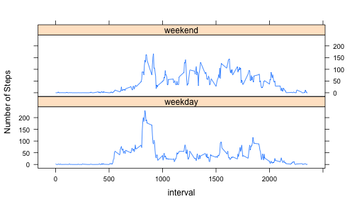

# Reproducible Research: Peer Assessment 1


## Loading and preprocessing the data


```r
require(plyr)
```

```
## Loading required package: plyr
```

```r
activity_df<-read.csv("activity.csv")
full_activity_df<-activity_df
activity_df<-subset(activity_df,!is.na(steps))
daily_steps<-ddply(activity_df,.(date), summarize, sum=sum(steps))
```
## Histogram of total number of step taken per day

```r
hist(daily_steps$sum,main="Daily Steps Histogram",xlab="Daily Steps",breaks=10)
```

 

```r
mean_steps_per_day<-mean(activity_df$steps)
median_setps_per_day<-median(activity_df$steps)
total_setps<-sum(activity_df$steps)
```
## What is mean total number of steps taken per day? 

```r
ddply(activity_df,.(date), summarize, mean=mean(steps),median=median(steps))[,c("date","mean","median")]
```

```
##          date    mean median
## 1  2012-10-02  0.4375      0
## 2  2012-10-03 39.4167      0
## 3  2012-10-04 42.0694      0
## 4  2012-10-05 46.1597      0
## 5  2012-10-06 53.5417      0
## 6  2012-10-07 38.2465      0
## 7  2012-10-09 44.4826      0
## 8  2012-10-10 34.3750      0
## 9  2012-10-11 35.7778      0
## 10 2012-10-12 60.3542      0
## 11 2012-10-13 43.1458      0
## 12 2012-10-14 52.4236      0
## 13 2012-10-15 35.2049      0
## 14 2012-10-16 52.3750      0
## 15 2012-10-17 46.7083      0
## 16 2012-10-18 34.9167      0
## 17 2012-10-19 41.0729      0
## 18 2012-10-20 36.0938      0
## 19 2012-10-21 30.6285      0
## 20 2012-10-22 46.7361      0
## 21 2012-10-23 30.9653      0
## 22 2012-10-24 29.0104      0
## 23 2012-10-25  8.6528      0
## 24 2012-10-26 23.5347      0
## 25 2012-10-27 35.1354      0
## 26 2012-10-28 39.7847      0
## 27 2012-10-29 17.4236      0
## 28 2012-10-30 34.0938      0
## 29 2012-10-31 53.5208      0
## 30 2012-11-02 36.8056      0
## 31 2012-11-03 36.7049      0
## 32 2012-11-05 36.2465      0
## 33 2012-11-06 28.9375      0
## 34 2012-11-07 44.7326      0
## 35 2012-11-08 11.1771      0
## 36 2012-11-11 43.7778      0
## 37 2012-11-12 37.3785      0
## 38 2012-11-13 25.4722      0
## 39 2012-11-15  0.1424      0
## 40 2012-11-16 18.8924      0
## 41 2012-11-17 49.7882      0
## 42 2012-11-18 52.4653      0
## 43 2012-11-19 30.6979      0
## 44 2012-11-20 15.5278      0
## 45 2012-11-21 44.3993      0
## 46 2012-11-22 70.9271      0
## 47 2012-11-23 73.5903      0
## 48 2012-11-24 50.2708      0
## 49 2012-11-25 41.0903      0
## 50 2012-11-26 38.7569      0
## 51 2012-11-27 47.3819      0
## 52 2012-11-28 35.3576      0
## 53 2012-11-29 24.4688      0
```

### Overall Mean Value - 37.3826
### Overall Median Value - 0

## What is the average daily activity pattern?


```r
average_steps_interval<-ddply(activity_df,.(interval), summarize, mean_steps=mean(steps))
plot(average_steps_interval$interval,average_steps_interval$mean_steps,type="l",
     main="Average Steps Interval Wise", xlab="5 Minutes Interval",ylab='Average Steps Taken')
```

 


```r
intervalmax<-subset(average_steps_interval,mean_steps==max((average_steps_interval$mean_steps)))$interval
```
## Invterval with maximum average number of steps across all days - 835

## Imputing missing values

```r
na_activity_df<-subset(full_activity_df,is.na(steps))
#Create new data set with replacing NA values with mean steps for the interval
na_activity_df_values<-merge(na_activity_df,average_steps_interval)[,c("mean_steps","date","interval")]
colnames(na_activity_df_values)<-c("steps","date","interval")
activity_df_new<-rbind(activity_df,na_activity_df_values)
# creating historgram of new activity data
hist(daily_steps$sum,main="Daily Steps Histogram with NA values Replaced",xlab="Daily Steps",breaks=10)
```

 


```r
mean_setps_per_day_imv<-mean(activity_df_new$steps)
median_setps_per_day_imv<-median(activity_df_new$steps)
total_setps_imv<-sum(activity_df_new$steps)
```
### Mean and Median steps taken per day after imputing missing values with average interval value
### Mean Value - 37.3826
### Median Value -0
Mean and Median values are not impacted by imputing missing values
Total steps taken with imputing missing values 6.5674 &times; 10<sup>5</sup> is greater than
Total steps taken withoput imputing missing values 570608
## Are there differences in activity patterns between weekdays and weekends?

### More steps are taken during weekend vs weekdays across all intervals


```r
library(lattice)
activity_df_new$date1<-as.Date(activity_df_new$date,format="%Y-%m-%d")
activity_df_new$weekday<-weekdays(activity_df_new$date1)
activity_df_new$wd_we<-activity_df_new$weekday
for (i in 1:nrow(activity_df_new)) {
        if (activity_df_new[i,]$weekday %in% c("Saturday","Sunday")){
                activity_df_new[i,]$wd_we="weekend"
        }
        else {activity_df_new[i,]$wd_we="weekday" }
}
wd_we_avg_steps<-ddply(activity_df_new,.(wd_we,interval), summarize, mean=mean(steps))
wd_we_avg_steps<-transform(wd_we_avg_steps,wd_we=factor(wd_we))
xyplot(mean~interval | wd_we,data=wd_we_avg_steps, layout=c(1,2),ylab="Number of Steps",type="l")
```

 
